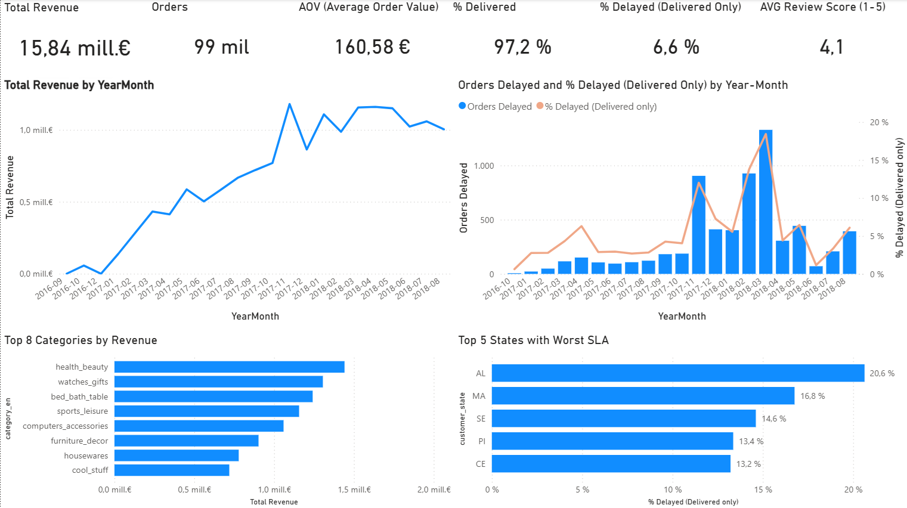
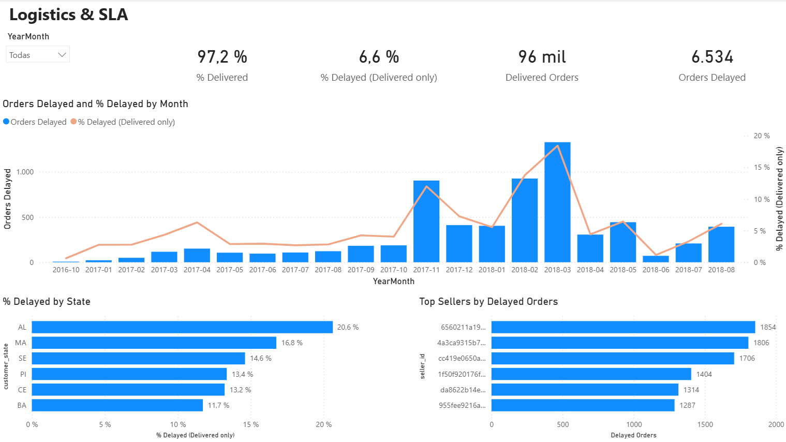
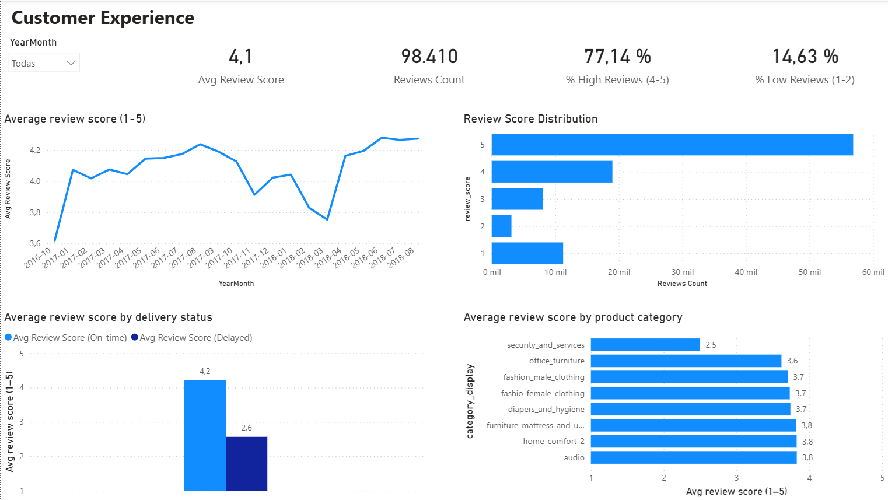
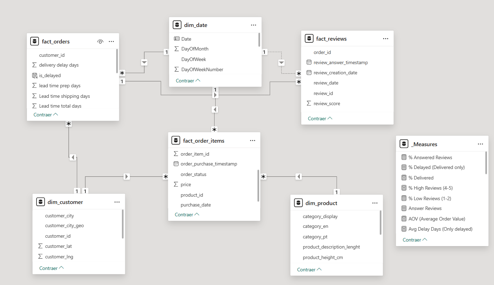

# Olist — Power BI E-Commerce Dashboard

Proyecto end-to-end en Power BI basado en el dataset público de **Olist (e-commerce brasileño)**.  
Objetivo: analizar **ventas**, **logística (SLA)** y **experiencia de cliente** con un **modelo en estrella** y métricas DAX defendibles.

## 📌 Descargar el informe (.pbix)
El archivo Power BI completo está disponible aquí:  
👉 [Descargar Power BI Dashboard]https://drive.google.com/file/d/1HTkyKZ6zT8nNHAE9d8DHpQp0U_F6XTQY/view?usp=sharing

> Nota: el archivo debe abrirse con **Power BI Desktop**.

## 🖼️ Capturas del dashboard

### Executive Overview

### Sales Performance

### Logistics & SLA

### Customer Experience

## 🧩 Modelo de datos

## 📂 Estructura del repositorio
- `powerbi/` → enlace de descarga del `.pbix` y detalle del entregable
- `screenshots/` → capturas del dashboard y del modelo
