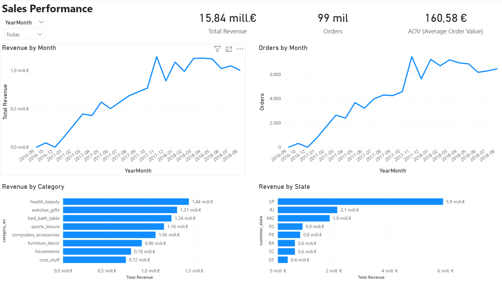

# Olist — Power BI E-Commerce Dashboard

Proyecto end-to-end en Power BI basado en el dataset público de **Olist (e-commerce brasileño)**.  
Objetivo: analizar **ventas**, **logística (SLA)** y **experiencia de cliente** con un **modelo en estrella** y métricas DAX defendibles.

## 🎯 Objetivo del proyecto

El objetivo de este proyecto es analizar el rendimiento de un e-commerce brasileño
a partir del dataset público de Olist, con foco en:

- Evolución de ventas y volumen de pedidos.
- Rendimiento logístico y cumplimiento de SLA.
- Impacto de la logística en la experiencia de cliente.
- Identificación de categorías, estados y sellers con peor desempeño.

El dashboard está pensado para apoyar la toma de decisiones a nivel ejecutivo,
comercial y operativo.

## 📌 Descargar el informe (.pbix)
El archivo Power BI completo está disponible aquí:  
👉 [Descargar Power BI Dashboard]https://drive.google.com/file/d/1HTkyKZ6zT8nNHAE9d8DHpQp0U_F6XTQY/view?usp=sharing

> Nota: el archivo debe abrirse con **Power BI Desktop**.

## 📊 Capturas del dashboard

### Executive Overview

### Sales Performance

### Logistics & SLA

### Customer Experience

## 🧩 Modelo de datos

## 📊 Insights y conclusiones

Algunos insights relevantes obtenidos del análisis:

### Ventas
- El revenue total supera los **15,8 M€**, con una tendencia claramente creciente
  hasta mediados de 2018.
- El **AOV se mantiene estable (160 €)**, lo que sugiere que el crecimiento
  está impulsado principalmente por el aumento del volumen de pedidos
  y no por un mayor ticket medio.
- Las 8 principales categorías concentran algo más de la mitad del revenue,
  mientras que el **46 % restante se reparte entre un elevado número de categorías**,
  lo que indica un catálogo diversificado y una menor dependencia
  de una única línea de producto.

### Logística & SLA
- El **97,2 % de los pedidos alcanzan el estado *Delivered***, mientras que
  aproximadamente un **2,8 % no llegan a completarse** (cancelados,
  no finalizados o con incidencias).
- Del total de pedidos entregados, un **6,6 % llegan con retraso**.
- Existen **estados con ratios de retraso significativamente superiores**
  (por encima del 15–20 %), lo que apunta a posibles ineficiencias
  logísticas a nivel regional.
- Algunos sellers concentran un volumen elevado de pedidos retrasados,
  lo que abre la puerta a acciones correctivas específicas
  y a una gestión más activa del rendimiento de vendedores.

### Experiencia de cliente
- La **puntuación media de reviews es elevada (4,1/5)**, reflejando
  una experiencia globalmente positiva.
- Sin embargo, los pedidos entregados con retraso presentan una
  **puntuación media de 2,6**, muy inferior tanto a la media global (4,1)
  como a la de los pedidos entregados a tiempo (4,2).
- Este diferencial evidencia un **impacto directo y significativo
  de la logística en la satisfacción del cliente**, convirtiendo
  la reducción de retrasos en un factor clave para mejorar
  la experiencia y la percepción del servicio.

## 📐 Métricas clave (DAX)

El dashboard se apoya en un conjunto de métricas definidas en DAX, centralizadas
en una tabla dedicada (`_Measures`) para garantizar consistencia, reutilización
y mantenibilidad del modelo.

Las métricas principales incluyen:

- **Total Revenue**: ingresos totales generados por los pedidos.
- **Orders**: número total de pedidos.
- **AOV (Average Order Value)**: ingreso medio por pedido.
- **% Delivered**: porcentaje de pedidos entregados correctamente.
- **Orders Delayed**: número de pedidos entregados con retraso.
- **% Delayed (Delivered only)**: porcentaje de retrasos calculado únicamente
  sobre pedidos entregados.
- **Avg Review Score**: puntuación media de las reviews (1–5).
- **% High Reviews (4–5)**: porcentaje de reviews positivas.
- **% Low Reviews (1–2)**: porcentaje de reviews negativas.
- **Avg Review Score (On-time vs Delayed)**: comparación de la puntuación media
  según el estado de entrega.
- **Avg Review Score by Product Category**: puntuación media por categoría de
  producto, utilizando medidas avanzadas para cruzar hechos de pedidos y reviews.

Estas métricas permiten analizar de forma integrada el rendimiento comercial,
la calidad logística (SLA) y su impacto directo en la experiencia del cliente.

## 🧠 Decisiones de diseño

Durante el desarrollo del dashboard se tomaron las siguientes decisiones de diseño:

- **Modelo en estrella**:  
  El modelo de datos se diseñó siguiendo un esquema en estrella, con tablas de
  hechos (`fact_orders`, `fact_order_items`, `fact_reviews`) y dimensiones
  (`dim_date`, `dim_customer`, `dim_product`), facilitando la lectura del modelo
  y el rendimiento de las consultas.

- **Separación de métricas en una tabla dedicada (`_Measures`)**:  
  Todas las métricas DAX se centralizan en una tabla independiente para mejorar
  la organización, evitar duplicidades y facilitar el mantenimiento.

- **Definición clara de KPIs logísticos**:  
  Los indicadores de retraso se calculan exclusivamente sobre pedidos entregados,
  evitando distorsiones derivadas de pedidos cancelados o no completados.

- **Consistencia temporal**:  
  El análisis se apoya en una dimensión de fechas común (`dim_date`) que permite
  comparar métricas de ventas, logística y reviews en un mismo eje temporal.

- **Selección de visualizaciones**:  
  - Gráficos de líneas para identificar tendencias temporales.
  - Barras horizontales para rankings y comparativas entre categorías, estados
    o sellers.
  - KPIs destacados para métricas clave de negocio.

- **Enfoque business-driven**:  
  El dashboard está orientado a responder preguntas de negocio concretas
  (rendimiento de ventas, calidad del servicio logístico e impacto en la
  satisfacción del cliente), más allá de una visualización descriptiva de datos.

## 📂 Estructura del repositorio
- `powerbi/` → enlace de descarga del `.pbix` y detalle del entregable
- `screenshots/` → capturas del dashboard y del modelo
  
## ▶️ Cómo usar el proyecto

1. Descargar el archivo Power BI (`.pbix`) desde el enlace proporcionado.
2. Abrir el archivo con **Power BI Desktop**.
3. Navegar entre las distintas páginas del informe:
   - Executive Overview
   - Sales Performance
   - Logistics & SLA
   - Customer Experience
4. Utilizar los filtros temporales (`YearMonth`) para analizar la evolución
   de las métricas en el tiempo.
5. Explorar los distintos KPIs y visualizaciones para identificar patrones,
   insights y oportunidades de mejora.
